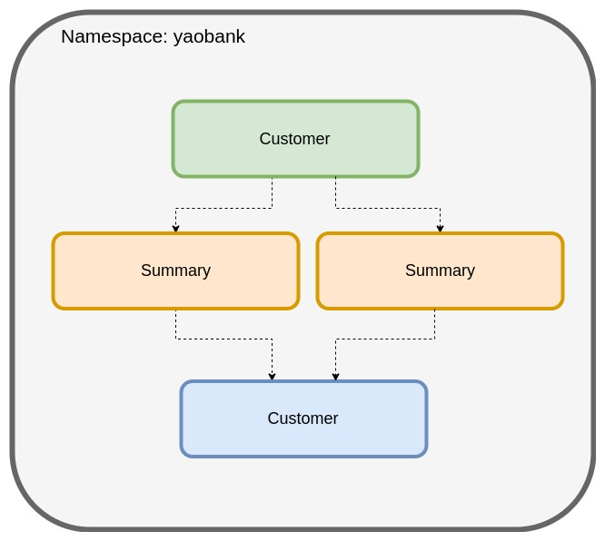

# 1. Lab1: Installing Calico on K8s

The first lab guides you through the process of installing Calico and deploying a sample application. 

In this lab, you will:
1.1. Install Calico
1.2. Launch a sample application (Yaobank) 
1.3. Access the sample application frontend GUI


## 1.1. Install Calico

Calico will be the networking (CNI) and network policy implementation throughout your training lab. To install Calico, run the following command in the terminal window.

```
kubectl apply -f 1-calico.yaml
```

## 1.2. Launch a sample application (yaobank)

For this lab, we will use a sample application called "Yet Another Online Bank" (yaobank) which consists of 3 microservices.
1. Customer (which provides a simple web GUI)
2. Summary (some middleware business logic)
3. Database (the persistent datastore for the bank)


The following diagram shows the logical diagram of the application.



### 1.2.1. Launch the application using the following commands

```
kubectl apply -f 1-yaobank.yaml
```

### 1.2.2. Check the status of the pods, wait until all are RUNNING status.
```
kubectl get pods -n yaobank
```
```
ubuntu@host1:~/calico-master/lab-manifests$ kubectl get pods -n yaobank
NAME                        READY   STATUS              RESTARTS   AGE
customer-5df6b999fb-qmbjz   1/1     Running             0          87s
database-7d4b6bf788-mgl2n   1/1     Running             0          87s
summary-6c755fccd5-mb54l    1/1     Running             0          87s
summary-6c755fccd5-s6b7w    1/1     Running             0          87s
```

### 1.2.3. You can also verify successful deployment with the `rollout status` command

```
kubectl rollout status -n yaobank deployment/customer
kubectl rollout status -n yaobank deployment/summary
kubectl rollout status -n yaobank deployment/database
```


## 1.3. Access the Sample Application Web GUI

Browse to the "Web Application" URL sent with your lab login details. You should see the bank balance for a user account.

> __Congratulations! You have completed your first lab.__

